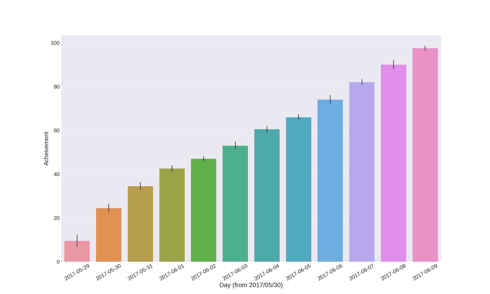

# nlp100

[言語処理100本ノック 2015](http://www.cl.ecei.tohoku.ac.jp/nlp100/) をやりました。だいだいpython、80~99あたりはところどころjulia

## 過程

横軸が日付、縦軸が達成した問題数です

手元のファイル更新日時を元に計算しました。過去の問に戻って編集していたこともあるので、値は一部正確ではありませんが、だいたいこんな感じのようです。
